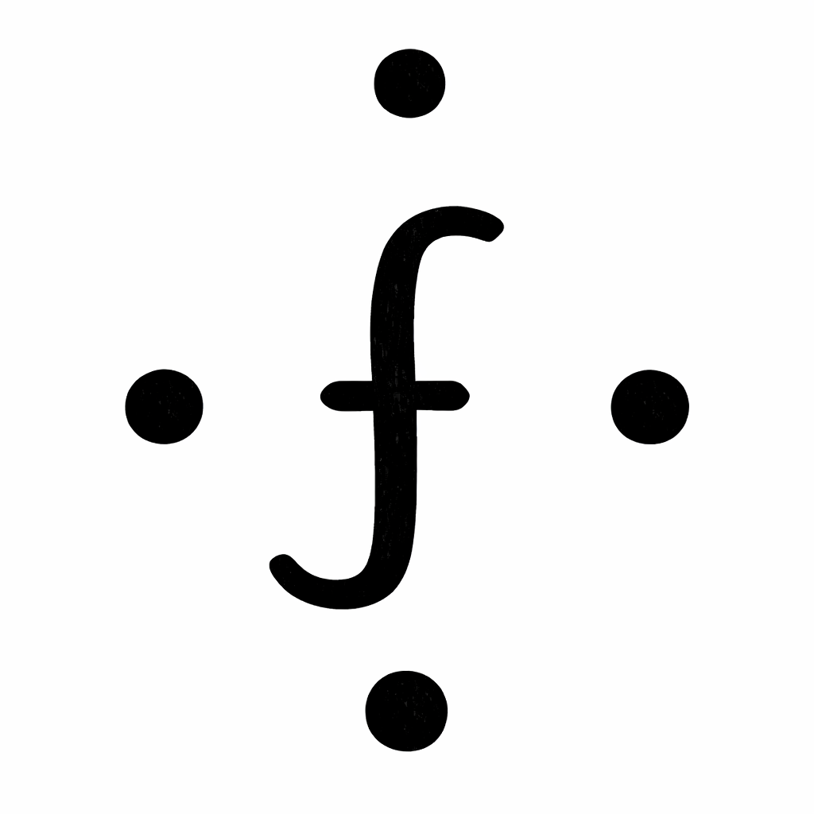

# friedn

<p align="center">
  
</p>

[](https://github.com/YOUR_USERNAME/friedn/actions)
[](https://opensource.org/licenses/MIT)
[](https://www.paypal.com/paypalme/YannikR)

An open-source Android app blocker that uses NFC tags as physical keys to unlock distracting apps.

## What is friedn?

friedn (pronounced "frieden") is a **free and open-source** productivity tool designed to help you break the habit of mindlessly scrolling through distracting apps on your Android phone. Unlike traditional app blockers that can be easily disabled with a few taps, friedn requires you to physically scan a registered NFC tag to toggle blocking on or off. This physical friction helps you stay intentional about your screen time. This project was inspired by the apps Brick and Tapout and is supposed to be a free alternative to them.

> **Disclaimer**: Brick and Tapout are trademarks of their respective owners. This project is not affiliated with, endorsed by, or connected to them.

## Basic Functionality

- **Block distracting apps**: Choose which apps you want to block (social media, games, etc.)
- **NFC tag as a key**: Register any NFC tag (card, sticker, keychain) to act as your physical "key"
- **Enable/Disable with a tap**: Scan your NFC tag to toggle blocking on or off
- **Timer mode**: Set a duration for automatic blocking (e.g., focus for 2 hours)
- **Overlay blocking**: When blocking is active, a lock screen appears if you try to open a blocked app
- **No data is stored on the NFC tag**
- **No user data is is tracked or stored by third party services**


## Setup

After installing the app, complete these setup steps:

1. **Register NFC Tag**: Tap "NFC Tag" and scan your NFC tag to register it
2. **Enable Accessibility Service**: Required to detect when blocked apps are launched
3. **Grant Overlay Permission**: Required to display the lock screen over blocked apps
4. **Select Apps to Block**: Choose which apps you want to block

Once setup is complete, scan your NFC tag to enable blocking.

## Getting Started

### Install dependencies

```bash
flutter pub get
```

### Run the app

```bash
# Run in debug mode
flutter run

# Run in release mode
flutter run --release
```

### Build APK

```bash
# Build debug APK
flutter build apk --debug

# Build release APK
flutter build apk --release
```

The built APK will be located at `build/app/outputs/flutter-apk/`.

## Contributing

Contributions are welcome! This is an open-source project and we appreciate your help.

### How to Contribute

1. **Fork the repository** and create your branch from `main`
2. **Make your changes** - fix bugs, add features, or improve documentation
3. **Test your changes** - ensure the app builds and runs correctly
4. **Submit a Pull Request** with a clear description of your changes

### Reporting Issues

If you find a bug or have a feature request, please [open an issue](https://github.com/YOUR_USERNAME/friedn/issues).

## License

This project is licensed under the MIT License - see the [LICENSE](LICENSE) file for details.

## Support

If you find this project helpful, consider supporting its development:

[](https://www.paypal.com/paypalme/YOUR_PAYPAL_ID)
